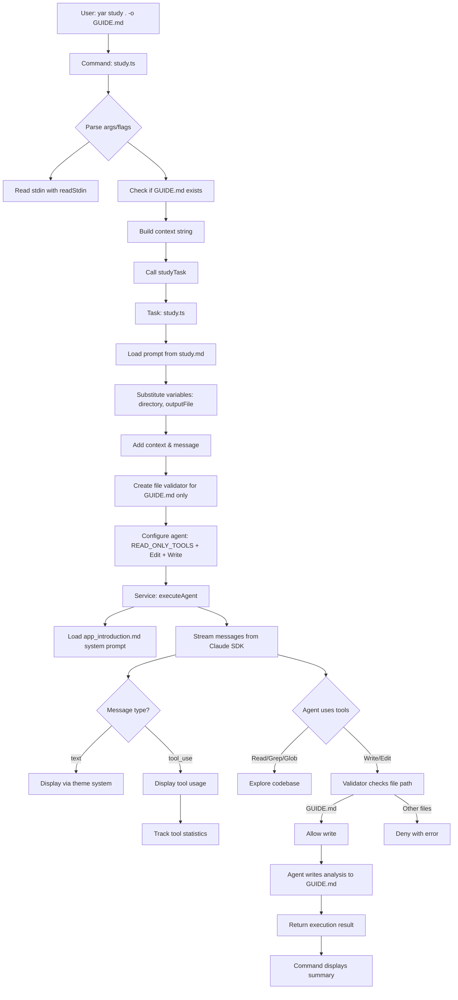

# YAR Contributor Onboarding Guide _(Generated by Yar Agent)_

**Analysis Date:** October 5, 2025

**Last Updated:** October 5, 2025 at 05:45 PM GMT+2

---

## Table of Contents

1. [Overview](#overview)
2. [Getting Started](#getting-started)
   - Prerequisites
   - Quick Setup
   - First Win
3. [Architecture](#architecture)
   - High-Level Structure
   - Directory Organization
   - Data Flow Example
   - Key Abstractions
4. [How To](#how-to)
   - Add a New Command
   - Run Tests
   - Debug Issues
   - Build and Deploy
   - Handle Piped Input
5. [Key Insights](#key-insights)
   - Design Decisions
   - Conventions and Patterns
   - Gotchas and Non-Obvious Behavior
   - Modern vs Legacy
6. [Dependencies & Integrations](#dependencies--integrations)
7. [Common Development Workflows](#common-development-workflows)
8. [FAQ for New Contributors](#faq-for-new-contributors)
9. [Open Questions & Uncertainties](#open-questions--uncertainties)

---

## Overview

YAR (یار - meaning "companion" in Farsi) is an AI-powered CLI tool that helps developers understand complex codebases quickly. Built on Anthropic's Claude Agent SDK and the oclif CLI framework, it provides three core commands:

1. **`yar study`** - Analyzes directory structure and creates onboarding guides
2. **`yar timeline`** - Traces Git history to understand codebase evolution
3. **`yar present`** - Converts markdown content into reveal.js presentations

The tool is designed to be **read-only by default** for safety, uses AI agents to explore code autonomously, and progressively updates output files rather than regenerating from scratch.

## Getting Started

### Prerequisites

- Node.js 18+
- Claude Code CLI installed (`npm install -g @anthropic-ai/claude-code-cli`)
- `ANTHROPIC_API_KEY` environment variable set
- pnpm package manager

### Quick Setup

```bash
# Clone and install
git clone <repo-url>
cd yar
pnpm install

# Build the project
pnpm run build

# Run in development mode (no build needed)
./bin/dev.js study . -o analysis.md

# Run built version
./bin/run.js study . -o analysis.md
```

### First Win: Run Study Command

```bash
# Analyze current directory and create a guide
./bin/dev.js study . -o GUIDE.md

# Watch the agent explore your codebase using Read, Grep, Glob tools
# Result: A comprehensive onboarding guide written to GUIDE.md
```

**Key Gotcha**: The `-o` flag (output file) is **required** for `study` and `timeline` commands. This is by design - the agent writes directly to the file rather than outputting to stdout.

## Architecture

### High-Level Structure

YAR follows a **strict layered architecture** that separates concerns:

```
┌─────────────────────────────────────────────────────┐
│  Commands (src/commands/)                           │
│  Thin CLI layer - parsing args/flags only          │
└─────────────────┬───────────────────────────────────┘
                  │
                  ▼
┌─────────────────────────────────────────────────────┐
│  Tasks (src/tasks/)                                 │
│  Business logic orchestration                       │
└─────────────────┬───────────────────────────────────┘
                  │
                  ▼
┌─────────────────────────────────────────────────────┐
│  Services (src/services/)                           │
│  Reusable components - agent, prompt-builder        │
└─────────────────┬───────────────────────────────────┘
                  │
                  ▼
┌─────────────────────────────────────────────────────┐
│  Utils (src/utils/)                                 │
│  Pure utility functions - stdin, date               │
└─────────────────────────────────────────────────────┘
```

### Directory Organization

```
src/
├── commands/          # oclif CLI commands (thin wrappers)
│   ├── study.ts       # Study command
│   ├── timeline.ts    # Timeline command
│   ├── present.ts     # Present command
│   └── ui-demo.ts     # UI system demo
│
├── tasks/             # Business logic orchestration
│   ├── study.ts       # Study task implementation
│   ├── timeline.ts    # Timeline task implementation
│   └── present.ts     # Present task implementation
│
├── services/          # Core reusable services
│   ├── agent.ts       # AI agent orchestration & message handling
│   └── prompt-builder.ts  # Prompt loading & variable substitution
│
├── config/            # Configuration & constants
│   ├── tools.ts       # Tool definitions and sets
│   └── tool-validators.ts  # File access validation
│
├── prompts/           # ALL prompts as Markdown files
│   ├── system/        # System prompts (define agent behavior)
│   │   └── app_introduction.md
│   └── tasks/         # Task-specific prompts with {{variables}}
│       ├── study.md
│       ├── timeline.md
│       └── present.md
│
├── lib/
│   └── theme/         # UI rendering system
│       ├── interface.ts   # Theme interface definition
│       ├── manager.ts     # Global theme singleton
│       ├── default.ts     # Default theme implementation
│       └── index.ts       # Public API
│
└── utils/             # Pure utility functions
    ├── stdin.ts       # Read piped input
    └── date.ts        # Date formatting for context
```

**Critical Convention**: ES modules require `.js` extensions in imports even though files are `.ts`:
```typescript
import {studyTask} from '../tasks/study.js'  // ✅ Correct
import {studyTask} from '../tasks/study'     // ❌ Wrong
```

### Data Flow: Study Command Example

Let's trace how `yar study . -o GUIDE.md` works:



### Key Abstractions

#### 1. **Agent Configuration** (`AgentConfig`)

Every task configures the AI agent with:
- **`allowedTools`**: Which tools agent can use (Read, Write, Bash, etc.)
- **`canUseTool`**: Optional validator function for fine-grained control
- **`systemPrompt`**: Optional custom system prompt

```typescript
// Study task: Read-only + Write/Edit restricted to output file
const config = {
  allowedTools: [...READ_ONLY_TOOLS, 'Edit', 'Write'],
  canUseTool: createFileAccessValidator(outputFile)
}

// Timeline task: Also needs Bash for git commands
const config = {
  allowedTools: [...READ_ONLY_TOOLS, 'Bash', 'Edit', 'Write'],
  canUseTool: createFileAccessValidator(outputFile)
}

// Present task: No tools needed (just text generation)
const config = {
  allowedTools: []
}
```

#### 2. **Tool Validators** (`createFileAccessValidator`)

Critical security feature that restricts Edit/Write tools to specific files or patterns:

```typescript
// Only allow writing to specific file
const validator = createFileAccessValidator('/path/to/output.md')

// Allow writing to directory
const validator = createFileAccessValidator('/path/to/docs')

// Pattern matching
const validator = createFileAccessValidator(/\.md$/)
```

**Why this matters**: Prevents agents from accidentally modifying source code when only the output file should be touched.

#### 3. **Prompt System**

Two types of prompts:

**System Prompts** (`src/prompts/system/`):
- Define agent behavior and personality
- Loaded automatically at startup
- Currently just `app_introduction.md` with YAR's identity

**Task Prompts** (`src/prompts/tasks/`):
- Task-specific instructions
- Support variable substitution: `{{directory}}`, `{{outputFile}}`
- Loaded on-demand by tasks

```typescript
// Load task prompt with variable substitution
const basePrompt = await loadPromptFromFile(
  'src/prompts/tasks/study.md',
  { directory: '/path/to/analyze', outputFile: '/output.md' }
)

// Add user message and context
const finalPrompt = buildPrompt({
  basePrompt,
  message: 'Focus on security',  // From -m flag
  context: stdinInput             // From piped input
})
```

#### 4. **Theme System**

Singleton pattern for consistent terminal UI across all commands:

```typescript
import {theme} from '../lib/theme/index.js'

// Display components
theme().header('Analysis Complete')
theme().info('Processing directory...')
theme().success('Done!')
theme().warning('Note: ...')
theme().error('Failed!')

// Structured output
theme().summaryBox('Complete', {
  'Duration': '45s',
  'Messages': 12,
  'Tools': 150
})

// Tool usage stats (automatically tracked)
theme().displayToolStats(result.toolUseCounts)
```

**Gotcha**: Always import from `./lib/theme/index.js`, never `./lib/ui.js` (deprecated).

## How To

### Add a New Command

Follow this pattern (see `docs/CREATING_COMMANDS.md` for full guide):

1. **Create task prompt**: `src/prompts/tasks/mycommand.md`
   ```markdown
   Analyze {{directory}} and generate a report focusing on {{aspect}}.
   ```

2. **Create task**: `src/tasks/mycommand.ts`
   ```typescript
   export interface MyCommandOptions {
     directory: string
     aspect?: string
     message?: string
     context?: string
     showUI?: boolean
   }

   export async function myCommandTask(options: MyCommandOptions) {
     const prompt = await buildMyPrompt(...)
     const config = { allowedTools: READ_ONLY_TOOLS }
     return await executeAgent({ config, prompt, showUI })
   }
   ```

3. **Create command**: `src/commands/mycommand.ts`
   ```typescript
   export default class MyCommand extends Command {
     static args = { directory: Args.string({...}) }
     static flags = { message: Flags.string({...}) }

     async run() {
       const {args, flags} = await this.parse(MyCommand)
       const stdinInput = await readStdin()
       const result = await myCommandTask({...})
       theme().summaryBox('Complete', {...})
     }
   }
   ```

4. **Build and test**:
   ```bash
   pnpm run build
   ./bin/dev.js mycommand . -m "test message"
   ```

### Run Tests

Currently **no traditional tests exist**. The project will use **evals** (evaluations) in the future to assess AI agent behavior quality.

### Debug Issues

1. **Check agent tool usage**: Look at `theme().displayToolStats()` output
2. **Verify file access**: Tool validators log denied operations
3. **Inspect prompts**: Prompts are in `src/prompts/` as readable Markdown
4. **Test in dev mode**: `./bin/dev.js` uses ts-node, no build needed
5. **Check API key**: Ensure `ANTHROPIC_API_KEY` is set

### Build and Deploy

```bash
# Build (compiles TypeScript + copies prompts)
pnpm run build

# Lint
pnpm run lint

# Prepare for npm publish
pnpm run prepack  # Generates manifest & updates README

# Publish (with changesets)
pnpm run release
```

**Important**: Build script copies `src/prompts/` to `dist/prompts/` since prompts are loaded at runtime.

### Handle Piped Input

All commands support piped input via `readStdin()`:

```bash
# Pipe git diff as context
git diff | yar study . -o analysis.md

# Pipe notes
cat notes.txt | yar timeline ./src -o evolution.md

# Chain commands
echo "Focus on performance" | yar study . -o report.md
```

Implementation:
```typescript
import {readStdin} from '../utils/stdin.js'

const stdinInput = await readStdin()
if (stdinInput) {
  theme().info(`Piped input: ${stdinInput.length} chars`)
}
```

## Key Insights

### Design Decisions

1. **Why layered architecture?**
   - **Commands** stay thin (just CLI parsing)
   - **Tasks** are reusable (can be called programmatically)
   - **Services** are generic (agent, prompt-builder work for any task)
   - Makes testing and maintenance easier as complexity grows

2. **Why agents write directly to files?**
   - Handles arbitrarily long output (not limited by terminal)
   - Supports progressive updates (Read existing → Edit sections)
   - Avoids issues with streaming large text to stdout
   - Enables CI/CD usage (deterministic file updates)

3. **Why separate prompt files?**
   - Non-engineers can edit prompts without touching code
   - Version control tracks prompt evolution
   - Easy to A/B test different approaches
   - Clear separation: code structure vs. agent instructions

4. **Why tool validators?**
   - Safety: Prevents accidental codebase modifications
   - Transparency: Clear what agents can/cannot touch
   - Flexibility: Can be file, directory, or regex pattern
   - Trust: Users know their code is safe during analysis

### Conventions and Patterns

**File Access Pattern**:
```typescript
// Study/Timeline: Agent writes to output file
const validator = createFileAccessValidator(outputFile)
const config = {
  allowedTools: [...READ_ONLY_TOOLS, 'Edit', 'Write'],
  canUseTool: validator
}
```

**Stdin Context Pattern**:
```typescript
// All commands check for piped input
const stdinInput = await readStdin()

// Build context from multiple sources
const contextParts = []
if (existingContent) contextParts.push(`EXISTING: ${existingContent}`)
if (stdinInput) contextParts.push(`PIPED: ${stdinInput}`)
const context = contextParts.join('\n\n---\n\n')
```

**Progressive Updates Pattern**:
```typescript
// Commands check if output file exists
let existingContent: string | undefined
try {
  existingContent = await fs.readFile(output, 'utf8')
} catch {
  // File doesn't exist, will create new
}

// Agent receives existing content as context
// Prompt instructs: "If file exists, use Edit tool to update sections"
```

**Theme Usage Pattern**:
```typescript
// Always show structure: header → info → divider → work → divider → summary
theme().header('Command Name')
theme().info('Starting...')
theme().divider()

// ... work happens ...

theme().divider()
theme().summaryBox('Complete', { Duration: '45s' })
theme().displayToolStats(toolUseCounts)
```

### Gotchas and Non-Obvious Behavior

1. **ES Module Import Extensions**
   - MUST use `.js` extension in imports even for `.ts` files
   - TypeScript's Node16 module resolution requires this
   - Forgot `.js`? → "Cannot find module" error

2. **Prompt Variable Substitution**
   - Uses simple regex: `{{variableName}}` → replaced with value
   - Undefined variables stay as `{{variableName}}` (no error)
   - Use meaningful names: `{{directory}}` not `{{dir}}`

3. **File Validator Behavior**
   - String path: Checks if file or directory at startup
   - Directory: Allows all files within (recursive)
   - File: Only allows that exact file
   - RegExp: Matches against resolved absolute paths
   - Only restricts Edit/Write, Read/Grep always allowed

4. **Agent Message Streaming**
   - Messages come as async iterator
   - Types: `assistant` (content blocks) or `result` (summary)
   - Content blocks: `text` (display) or `tool_use` (track)
   - `stop_reason: 'tool_use'` → more messages coming

5. **Theme Tool Stats**
   - Automatically accumulated across all commands
   - Persisted in ThemeManager singleton
   - Displayed with `theme().displayToolStats()`
   - Reset on process exit

6. **Output File Requirement**
   - Study/Timeline commands REQUIRE `-o` flag
   - This is intentional: agents write analysis, not print to stdout
   - Present command also requires `-o` but uses different flow (command writes, not agent)

### Modern vs Legacy

**Modern** (current best practices):
- Import from `./lib/theme/index.js` for UI
- Use `executeAgent()` service, not direct Claude SDK calls
- Load prompts from `src/prompts/` MD files
- Use tool validators for file access control
- TypeScript with strict mode + ES modules

**Legacy** (avoid):
- `./lib/ui.js` exports (deprecated, use theme system)
- Hardcoded prompts in TypeScript strings
- Direct SDK usage without agent service wrapper

## Dependencies & Integrations

### Core Dependencies

**Claude Agent SDK** (`@anthropic-ai/claude-agent-sdk`)
- Provides agent orchestration and tool system
- Handles message streaming from Claude API
- Includes built-in tools: Read, Write, Edit, Grep, Glob, Bash, ListDir

**oclif** (`@oclif/core`, plugins)
- CLI framework (industry standard)
- Automatic help generation
- Command discovery and routing
- Plugin system for extensibility

**Anthropic SDK** (`@anthropic-ai/sdk`)
- Low-level Claude API client
- Used internally by Agent SDK
- Direct usage should be avoided (use agent service)

### UI/UX Libraries

- **chalk**: Terminal colors and styling
- **ora**: Spinners and progress indicators
- **boxen**: Bordered boxes for summaries
- **cli-table3**: Structured tables
- **figures**: Cross-platform Unicode symbols
- **gradient-string**: Gradient text effects

### Development Tools

- **TypeScript**: Strict mode, Node16 module resolution
- **ts-node**: Development mode execution
- **ESLint**: Linting with oclif config
- **Prettier**: Code formatting
- **Changesets**: Version management and changelogs

### External Services

**Claude API** (via Anthropic SDK)
- Requires `ANTHROPIC_API_KEY` environment variable
- Uses user's existing Claude subscription
- No additional charges beyond normal API usage

**Git** (optional, for timeline command)
- Timeline command needs Git repository
- Uses `Bash` tool to run git commands
- Study/Present commands work without Git

### Configuration

**Environment Variables**:
- `ANTHROPIC_API_KEY`: Required for all commands

**Package Configuration** (`package.json`):
- `"type": "module"`: ES modules mode
- `"bin": {"yar": "./bin/run.js"}`: Global CLI entry point
- `"preferGlobal": true`: Optimized for global install

**TypeScript Configuration** (`tsconfig.json`):
- `"module": "Node16"`: ES module support
- `"strict": true`: Maximum type safety
- `"target": "es2022"`: Modern JavaScript features

## Common Development Workflows

### Making Your First Contribution

1. **Pick a task** - Look for issues labeled "good first issue"
2. **Set up locally**:
   ```bash
   git clone <repo>
   cd yar
   pnpm install
   ./bin/dev.js study . -o test.md  # Verify it works
   ```
3. **Make your changes** - Follow the layered architecture
4. **Test manually**:
   ```bash
   pnpm run build
   ./bin/dev.js your-command
   ```
5. **Lint**: `pnpm run lint`
6. **Commit**: Follow Angular convention (e.g., `feat: add new command`)
7. **Open PR** - Describe what you changed and why

### Debugging Agent Behavior

When the agent doesn't behave as expected:

1. **Check the prompt** - Read `src/prompts/tasks/[command].md`
   - Is the instruction clear?
   - Are variables substituting correctly?

2. **Watch tool usage** - The UI shows every tool call
   - Is the agent using the right tools?
   - Is it reading the right files?

3. **Check tool validators** - File access might be blocked
   - Look for "Access denied" messages
   - Verify the validator pattern in task code

4. **Inspect context** - What additional context is provided?
   - Existing file content?
   - Piped stdin input?
   - User message from `-m` flag?

5. **Test with simpler input**:
   ```bash
   # Minimal test
   ./bin/dev.js study src/commands/ -o test.md

   # Add specific guidance
   ./bin/dev.js study . -m "Focus only on architecture" -o test.md
   ```

### Modifying Prompts Without Code Changes

You can tweak agent behavior by just editing Markdown files:

```bash
# Edit the study prompt
vim src/prompts/tasks/study.md

# No build needed in dev mode!
./bin/dev.js study . -o test.md

# Or build for production
pnpm run build
./bin/run.js study . -o test.md
```

**Tip**: This is the fastest way to experiment with agent behavior. No TypeScript knowledge required!

### Testing File Access Validation

```typescript
// In your task file
import {createFileAccessValidator} from '../config/tool-validators.js'

// Only allow writing to output.md
const validator = createFileAccessValidator('/path/to/output.md')

// Try to write elsewhere - should be denied
const config = {
  allowedTools: ['Read', 'Write'],
  canUseTool: validator
}
```

Run your command and watch for "Access denied" messages if the agent tries to write to unauthorized files.

### Iterating on UI/Theme Changes

```bash
# Make changes to src/lib/theme/default.ts
vim src/lib/theme/default.ts

# Test immediately in dev mode
./bin/dev.js study . -o test.md

# Watch the UI changes in real-time
```

### Creating a New Command (Quick Version)

```bash
# 1. Copy existing files as templates
cp src/prompts/tasks/study.md src/prompts/tasks/mycommand.md
cp src/tasks/study.ts src/tasks/mycommand.ts
cp src/commands/study.ts src/commands/mycommand.ts

# 2. Edit each file - replace "study" with "mycommand"
# 3. Customize the prompt in mycommand.md
# 4. Adjust tool configuration in task file

# 5. Build and test
pnpm run build
./bin/dev.js mycommand . -o output.md
```

See `docs/CREATING_COMMANDS.md` for the complete guide.

## FAQ for New Contributors

### Why use `.js` extensions in TypeScript imports?

YAR uses ES modules with Node16 module resolution. TypeScript requires `.js` extensions even though files are `.ts` because:
- The extensions refer to the *output* files after compilation
- Node.js native ESM requires explicit extensions
- This is standard TypeScript ESM behavior

```typescript
// ✅ Correct
import {studyTask} from '../tasks/study.js'

// ❌ Wrong - will fail at runtime
import {studyTask} from '../tasks/study'
```

### How do I test my changes?

```bash
# No build needed - use dev mode with ts-node
./bin/dev.js study . -o test.md

# Or build first
pnpm run build
./bin/run.js study . -o test.md
```

### Why does the agent write files instead of printing output?

Design philosophy:
1. **Unlimited length** - Not constrained by terminal buffer
2. **Progressive updates** - Can Read existing file → Edit specific sections
3. **CI/CD friendly** - Deterministic file updates for automation
4. **Better UX** - User specifies exact output location with `-o`

### Can I use YAR without Claude API access?

No. YAR requires:
- Claude API key (`ANTHROPIC_API_KEY` env var)
- Active Claude subscription or API credits
- Claude Agent SDK depends on this

### What's the difference between commands and tasks?

**Commands** (`src/commands/`):
- Thin CLI wrappers using oclif
- Parse arguments and flags
- Display UI output
- Call tasks

**Tasks** (`src/tasks/`):
- Core business logic
- Can be called programmatically (not just from CLI)
- Orchestrate services
- Return structured results

This separation makes testing easier and enables reusing task logic.

### How do I add a new tool?

You can't easily add custom tools - the available tools come from Claude Agent SDK:
- Read, Write, Edit, Grep, Glob, Bash, ListDir

To "extend" functionality:
1. Use Bash tool to run custom scripts
2. Compose existing tools in your task prompt
3. Contribute to Claude Agent SDK for truly new tools

### Why are prompts in separate MD files?

Benefits:
- **Non-engineers can edit** - No code changes needed to tweak behavior
- **Version control** - Track prompt evolution separately from code
- **A/B testing** - Easy to experiment with different approaches
- **Readability** - Much easier to read/edit than template strings in code

### What's the agent execution flow?

```
1. Load prompt from MD file (e.g., study.md)
2. Substitute variables: {{directory}} → actual value
3. Add user context (stdin, existing file, -m message)
4. Configure tools and validators
5. Call executeAgent() service
6. Stream messages from Claude API
7. Display tool usage in real-time
8. Return results to command
9. Show summary statistics
```

## Open Questions & Uncertainties

### Architecture Questions

1. **System Prompt Documentation Mismatch**: CLAUDE.md and docs/CREATING_COMMANDS.md reference `CODE_ANALYSIS_SYSTEM_PROMPT`, `CODE_GENERATION_SYSTEM_PROMPT`, and `GENERAL_ASSISTANT_SYSTEM_PROMPT` but these **don't exist in the actual codebase**. Only `app_introduction.md` exists. The documentation appears to be aspirational or outdated. Currently, all behavior comes from task prompts plus the base introduction prompt.

2. **Tool Usage Tracking**: The theme system automatically tracks tool usage globally via `ThemeManager` singleton, but it's unclear if stats are reset between commands when running multiple commands in sequence. This could lead to cumulative stats that don't reflect individual command usage.

3. **MCP Integration**: `package.json` includes `@modelcontextprotocol/sdk` dependency but it's not used anywhere in the codebase. Is this for future features or leftover from experimentation?

4. **Error Recovery**: What happens if an agent crashes mid-analysis after writing part of the output file? Is there a recovery mechanism or does the user need to manually fix the partial file?

### Implementation Uncertainties

1. **Stdin Timeout**: `readStdin()` uses 100ms timeout by default. Is this sufficient for large piped inputs? Could miss data if stdin is slow.

2. **File Validator Edge Cases**: When `createFileAccessValidator` receives a path that doesn't exist yet, it assumes it's a file (not directory). This might cause issues if the path is intended to be a directory but hasn't been created yet.

3. **Present Command Flow**: Unlike study/timeline, the `present` command writes the file itself rather than having the agent write. Why the different pattern? Was this a conscious design choice or just different implementation timing?

4. **Present Command Update Flag**: The `--update` flag requires existing file for updates but errors if file doesn't exist. Is there a use case for updating in-place vs. always regenerating? The pattern differs from study/timeline which auto-detect existing files.

**Note**: Theme initialization happens in `src/lib/theme/index.ts` at module load time via `ThemeManager.setTheme(new DefaultTheme())`. This is called automatically when any code imports from the theme module.

### Documentation Gaps

1. **Evals System**: Documentation mentions "evaluations" for testing but no implementation exists. What's the planned approach? Where will evals live?

2. **CI/CD Usage**: README shows GitHub Actions example but no actual workflow files in `.github/`. Are there working examples elsewhere?

3. **Plugin System**: oclif supports plugins (`@oclif/plugin-plugins` is installed) but no documentation on creating YAR-specific plugins.

### Questions for New Developers

1. **When to create a new system prompt vs. task prompt?**
   - System prompts seem underutilized (only one exists)
   - Most behavior is in task prompts
   - Guidelines for this split would be helpful

2. **How to handle secrets in analysis?**
   - Agents could read `.env` files or API keys
   - No apparent sanitization or warnings
   - Should there be a blocklist of sensitive files?

3. **Extending the tool system beyond Claude SDK tools?**
   - Can we add custom tools?
   - How would that integrate with the current architecture?

4. **Performance optimization for large codebases?**
   - Does the agent have token limits that could be hit?
   - Are there strategies for analyzing monorepos?
   - Should we chunk large analyses?

### Nice-to-Have Clarifications

1. Build script copies `src/prompts/` to `dist/prompts/` - but why not just reference source directly in dev mode?

2. `src/lib/ui-example.ts` exists - is this for documentation/demo purposes or used somewhere?

3. `src/commands/ui-demo.ts` - is this shipped to users or just for development?

4. Theme system has `getSpinner()` method but it's rarely used directly. What's the intended use case?

---

**Note to maintainers**: This guide reflects the codebase as of October 5, 2025. As YAR evolves, please update this document, especially the "Open Questions" section as they get resolved.
